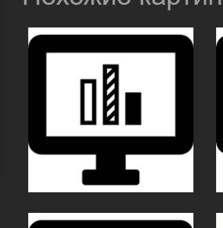

### PNG Example
Single png inside md Example




### CTRL+K+C / CTRL+K+U
https://stackoverflow.com/questions/12066739/what-key-shortcuts-are-to-comment-and-uncomment-code

### FluentCpp
https://www.fluentcpp.com/

### Cpp Core Guidelines
https://isocpp.github.io/CppCoreGuidelines/CppCoreGuidelines

#  ###########################################################

### DesignersUtils
Online Utilities and websites with useful designer features for everyday

| DesignersUtils                                        |  Link                                                            |
|-------------------------------------------------------|------------------------------------------------------------------|
|                                                       | https://myip.ru/                                                 |
|                                                       | https://myip.ru/                                                 |
| ....................................................  | ...............................................                  |
| CLeoMoon SessionGuard (имитатор движения мыши)        | https://leomoon.com/downloads/desktop-apps/leomoon-sessionguard/ |
| ....................................................  | ...............................................                  |
| Построение Блок-Схем и диаграмм - yEd                 | https://www.yworks.com/products/yed                              |
| Построение диаграмм классов - UMLet                   | https://www.umlet.com/                                           |
| UML-designer - PlantUML                               | https://www.planttext.com/                                       |
| PlantUML guide                                        | http://pdf.plantuml.net/PlantUML_Language_Reference_Guide_ru.pdf |
| Просмотр зависимостей Dependency Walker (New ver.)    | https://github.com/lucasg/Dependencies/releases                  |
| CppCheck - Static Code Analyser                       | http://cppcheck.sourceforge.net/                                 |
| ....................................................  | ...............................................                  |
| FREE ICONS                                            | https://www.1001freedownloads.com/free-clipart/icon-set-player   |
| ....................................................  | ...............................................                  |
| GET COLOR FROM IMAGE                                  | https://imagecolorpicker.com/                                    |
| INVERT COLOR OF IMAGE                                 | https://pinetools.com/invert-image-colors                        |
| CHANGE 1 COLOR IN AN IMAGE COLORIZE IMAGE             | https://pinetools.com/colorize-image                             |
| CHANGE 1 COLOR IN AN IMAGE COLORIZE IMAGE             | https://onlinepngtools.com/change-png-color                      |
| ICO Icon creator                                      | http://www.xiconeditor.com/                                      |
| ENGLISH IN IT-WEB-DEVELOPMENT-APPS-GRAFICAL-INTERFACE | http://wordexpert.ru/forum/viewtopic.php?id=1526                 |


### https://i.snag.gy/nTPI3R.jpg

### *

- Для графического редактора необходимо спроектировать подсистему загрузки / сохранения данных из различных форматов файлов (XML, JSON). Предусмотреть возможность расширения списка поддерживаемых форматов и фигур. Нарисовать диагрвммы классов и последовательностей. В представленной диаграмме требьуется реализовать такую врхитектуру, при которой иерархии объектов и форматов можно будет изменять независимо. Например должна быть возможность доавить формат фалйа ТХТ, не изменяя классы фигур. И наоборот - добавить новую фигуру не изменяя форматы.

### *

# JAVA INTERVIEW QUESTIONS

https://github.com/enhorse/java-interview

# HOTKEYS

| Набор клавмш             |  Действие                                                         |
|----------------------    |-------------------------------------------------------------------|
| Ctrl + Shift + F         | Найти Во всём проекте                                             |
| Ctrl + H                 | заменить много где во всём файле                                  |
| Alt                      | Горизонтальное выделение квадратом и редактирование Квадратом     |
| Ctrl + Shift + Left      |                                                                   |
| Ctrl + Shift + Right     |                                                                   |
| ....................     | ...............................................                   |
| Alt + Tab                |                                                                   |
| Alt + F4                 |                                                                   |
| ....................     | ...............................................                   |
| Ctrl + F                 |                                                                   |
| Crtl + L                 | Перейти к адресной строке проводника или Internet Explorer.       |
| F5                       | Обновить окно проводника или Internet                             |
| Backspace                |	Перейти на уровень вверх в окне проводника или Internet Explorer |
| ....................     | ...............................................                   |
| F2                       | переименовать файл / папку                                        |
|                          | Выдекление  / Перетаскивания с Shif / Ctrl                        |
| Insert !!!               | Переход на цифровую клаиватуру Num Lock !!!                       |
| ....................     | ...............................................                   |
| Ctrl + A                 |                                                                   |
| Ctrl + C                 |                                                                   |
| Ctrl + V                 |                                                                   |
| Shift + Insert           |                                                                   |
| Ctrl + X                 |                                                                   |
| Ctrl + S                 |                                                                   |
| Ctrl + Z                 |                                                                   |
| ....................     | ...............................................                   |
| Ctrl + Shift + Del       |                                                                   |
| Ctrl + Shift + Escape    |                                                                   |
| ....................     | ...............................................                   |
| Alt + Tab                |                                                                   |
| Ctrl + N                 |                                                                   |
| Ctrl + Shift + N         |                                                                   |
| ....................     | ...............................................                   |
| Win + E                  |                                                                   |
| Win + Pause              |                                                                   |
| Win + L                  |                                                                   |
| ....................     | ...............................................                   |
| Win + R                  |                                                                   |
| ....................     | ...............................................                   |
| cmd                      |                                                                   |
| notepad                  |                                                                   |
| mspaint                  |                                                                   |
| calc                     |                                                                   |
| services.msc             |                                                                   |
| regedit                  |                                                                   |
| ....................     | ...............................................                   |
| Switch between CPP and H |                                                                   |
| MSVS:	Ctrl + K + O       |                                                                   |
| Qt:		F4                 |                                                                   |


# English for english beginner friend

```
new [нью] - новый
old [олд] - старый
size [сайз] - размер
next [некст] - следующий / Далее
back [бэк] - назад / спина
previous [привэос] - предыдущий
data [дэйта] - данные
add [эд] - добавить
delete [делит] - удалить
step [стэп] - шаг
open [оупэн] - открыть
close [клоуз] - закрыть
save [сейв] - сохранить
load [лоад] - загрузить
option [опшн] - настройка, опция, вариант
propertie [проперти] - свойство
download [даунлоад] - скачать
upload [аплоад] - загрузить

who ? [ху] - кто
what ? [уот] - что
when ? [уэн] - когда
why ? [уай] - почему
how ? [хау] - как
whom ? [хум] - кому
about [эбаут] - о (чём-то / ком-то)

and [энд] - и
bool [бул] - булева
break [брэйк] - разбить
case [кейс] - случай
catch [кеч] - поймать / ловить
character [чарактэр] - символ, персонаж
cast [каст] - перевести (выполнить перевод из одного сост. в другое)
continue [континью] - продолжить
default [дефолт] - стандартный / по умолчанию
delete [делит] - удалить
do [ду] - делать
double [дабл] - двойной / удвоенный
dynamic [дайнэмик] - динамический
else [элс] - иначе
export [экспорт] - экспортировать
extern [экстерн] - внешний
false [фолс] - ЛОЖЬ
float [флоат] - плавающий (для цифр с плавающей точкой)
for [фор] - для
go to [гоу ту] - идити в
if [иф] - если
integer [интеджер] - целое (всмысле не дробное, про число)
name [нейм] - имя
space [спейс] - пробел, пространство
new [нью] - новый
pointer [поинтер] - указатель
private [прайвет] - приватный
protected [протектед] - защищённый
public [паблик] - публичный
return [ретёрн] - вернуть
short [шорт] - короткий
sign [сайн] - знак
signed [сайнт] - знаковый
size of [сайз оф] - размер (чего-то)
structure [страчер] - структура
switch [свич] - переключиться
template [темплейт] - шаблон
this [Зис] - это
thread [тред] - поток
local [локал] - локал
throw [фроу] - бросать
true [тру] - ИСТИНА
try [трай] - попытаться
type [тайп] - тип
union [юнион] - объединение
unsigned [ансайнт] - беззнаковый
use [юз] - использовать
using [юзинг] - используя
while [уайл] - во то время как

function [фанкшн] - функция
jump [джамп] - прыгать
big [биг] - большой
small [смол] - маленький
little [литл] - маленький
edit [эдит] - менять
deny [денай] - отменить
enable [энейбл] - задействовать
deprecated [деприкэйтед] - устаревший
call [кол] - вызвать, вызов
substract [сабстракт] - отнять / уменьшить
multiply [мультиплай] - умножить
erase [ирэйз] - стереть = удалить

add [эд] - добавить
insert [инсерт] - вставить
select [селект] - выбирать
new [нью] - создать

complete [комплит] - закончить / завершить / готов
incomplete [инкомплит] - незаконченный / незавершенный / неготов
different [дифферент] - другой / иной
difference [дифференс] - разница
algorythm [элгоритм] - алгоритм
compare [кмпэар] - сравнивать
read [рид] - читать
write [райт] - писать
access [эксэс] - доступ
word [ворд] - слово
last [лэст] - последний
first [фёрст] - первый
begin [бегин] - начало / начинать
end [энд] - конец / заканчивать
create [криэйт] - создавать
destroy [дестрой] - уничтожать
total [тотал] - полный / полностью
location [локэйшн] - место / позиция
recent[рисэнт] - текущий / настоящий
print [принт] - печатать
all [ол] - все
both [боуф] - оба
side [сайд] - сторона
letter [лэттэр] - письмо
preview [привью] - предпросмотр
attach [эттач] - вложение
share [шэр] - менять / обменивать / показывать / делиться
save [сэйв] - сохранять
load [лоад] - загружать
change [чейндж] - изменять
support [сапорт] - поддерживать
tool [тул] - инструмент
Check [чек] - проверять
Paste [пэйст] - Вставить
Cut [кат] - Вырезать
Font [фонт] - Шрифт
Color [колор] - Цвет 
Show [шоу] - показывать
Increase [инкриз] - увеличивать
Decrease [дериз] - уменьшать
Change [чейндж] - изменять
Find [файнд] - найти
Replace [реплэйс] - заменять / менять местами
Select [селект] - выбирать
Shape [шэйп] - форма
Blank [блэнк] - Пустая
Link [линк] - Ссылка
Header [хэдэр] - заголовок
Equation [экуэйжн] - выражение

Margin [маргин] - Поле
Page [пэйдж] - Страница
Line [лайн] - строка
Column [колам] - столбец
Column [колам] - Колонка
Even [ивэн] - Четная
Odd [од] - Нечетная
Left [лэфт] - Слева
Right [рфйт] - Справа
Before [бефор] - До
After [афтэр] - После 
Position [позишн] - Положение
Bring [бринг] - принести
Forward [форворд] - вперед
Backward [бэкворд] - назад 
Send [сэнд] - отправить 
Pane [пээн] - Область
Align [элайн] - Выровнять
Rotate [ротэйт] - Повернуть
angle [энгл] - угол
Mark [марк] - Пометить
Entry [энтри] - элемент
Note [ноут] - Показать сноски
Style [стайл] - Стиль
List [лист] - список
Rule [рул] - Правила
Field [фиилд] -  поле
Merge [мёрдж] - объединить
Split [сплит] - Разделить 

help [хэлп] - помогите, помогать, помощь
tab [тэб] - вкладка
home [хоум] - дом
push [пуш] - нажать, давить
page [пэйдж] - страница
reference [референс] - ссылка
mail [мэйл] - почта
view [вью] - вид, представление
review [ревью] - обзор
title [тайтл] - надпись
point [поинт] - точка
button [баттон] - кнопка
box [бокс] - коробка
scroll [скрол] - Ползунок
scroll box [скрол бокс] - Ползунок прокрутки
zoom [зум] - прибилжать
send [сэнд] - отправлять
recieve [ресив] - получать
layout [лэйаут] - разметка / схема / макет
label [лэйбл] - надпись
save [сэйв] - сохранить
save as [сэйв эз] - сохранить как
open [оупен] - открыть
close [клоуз] - закрыть
info [инфо] - сведения
recent [рисэнт] - последние
print [принт] - печать
options [опшн] - параметры
exit [экзит] - Выход

Window [уиндоу] - окно
Comment [коммент] - Примечание, Комментарии
Change [чейндж] - изменять
Accept [эксэпт] - принимать
Protect [протэкт] - защищать
Block [блок] - блокировать
Restrict [рестрикт] - запрещать / оагрничивать
Record [рекорд] - записывать
Security [секьюрити] - безопасность
Drop [дроп] - бросать
Pick [пик] - выбирать
Frame [фрэйм] - рамка 
Reset [рисэт] - перезагружать / перезапускать
Image [имэйдж] - изображение
Mode [моуд] - Режим 
Group [груп] - Группи
Schema [шэма] - Схема
Template [тэмплейт] - Шаблоны
Border [бордэр] - Границы
Pen [пэн] - перо
Style [стайл] - Стиль 
Weight [вэйт] - Толщина 
Height [хэйт] - Высота 
Widht [уидт] - Ширина 
Draw [дроу] - рисовать
Table [тэйбл] - Нарисовать таблицуэ
Eraser [эрэйзр] - Ластик
Fit [фит] - Автоподбор
Align [элайн] - Выровнять 
Repeat [рипит] - Повторить 
Convert [ковёрт] - Преобразовать 
Adjust [эджаст] - применять
Background [бэкграунд] - фон
Compress [компрэс] - сжимать
Wrap [урэп] - сворачивать / обёртка
Arrange [эррэйндж] - выстраивать / подстроить

Layout [лэйаут] - Макет 
Crop [кроп] - Обрезка

Forward [форвуард] - вперёд
Backward [бэквуард] - фон
Fill [фил] - заполнить
Outline [аутлайн] - контур
Direction [дайрекшн] - напрвление
Shape [шэйп] - Фигуры
Picture [пикчэр] - Рисунок
Axe [экс] - Ось / Оси (Икс / Игрек / Зэд)
Wall [уол] - Стенка
Area [эриа] - Область
Background [бэкграунд] - Фон
Up [ап] - над / наверх / наверху
Down [даун] - вниз / внизу
under [андэр] - под
over [оувэр] - над
Error [эррор] - ошибка
exception [эксэпшн] - исключение

point [поинт] - точка
line [лайн] - линия
polyline [полилайн] - многоугольная линия / ломаная
ellipse [эллипс] - элипс
circle [сиркл] - круг
rectangle [рэктэнгл] - прямоугольник
square [скуэар] - квадрат
triangle [трайэнгл] - треугольник
angle [энгл] - кгол
side [сайд] - сторона
polygon [полигон] - многоугольник

select [селект] - выбирать
insert [инсерт] - вставлять
update [апдейт] - обновлять
delete [делит] - удалять

include [инклуд] - вставлять
import [импорт] - подключать
return [ретёрн] - возвращать

memory [мэмори] - память
drive [драйв] - водить авто
sound [саунд] - звук
unique [юник] -  уникальный
description [дескрипшн] - описание
display [дисплэй] - отображать
launch [лаунч] - запускать
crash [скэр] - крах / авария / аварийное завершение
fall [фол] - падение
settings [сэттингз] - настройки
amount [эмаунт] - количество
must [маст] - должен
disable [дисэйбл] - отключать
prefear [прифэар] - предпочитать
count [каунт] - считать / пересчитывать / количество
engine [энджин] - двигатель / средство / инструмент
core [кор] - ядро
current [каррэнт] - текущий / данный
device [девайс] - устройство
brows [брауз] - одалживать
advanced [эдвансд] - дополнительно
direct [дайрект] - непосредственно / прямо / точно
custom [кастом] - определённая
сompatibillity [компатибилити] - совместимость
show [шоу] - показывать
with [уизтх] - с
specify [специфити] - указывать / уточнять
present [презент] - настоящий / имеющийся в наличии
allow [эллау] - допускать / дозволять
any [эни] - любой / каждый

```


### Посчитать количество установленных битов в двоичном представлении входного числа типа int
https://www.geeksforgeeks.org/count-set-bits-in-an-integer/

- Brian Kernighan's algorithm
```
int NumberOfSetBits(int n)
{
  int count = 0;
  while(n) {
    ++ count;
    n = (n - 1) & n;
  }
  return count;
}
// tCmplx: O(log n) // Space: O(1)
```
- Решение 2
```
unsigned int bitCount (unsigned int value)
{
  unsigned int count = 0;
  while (value > 0) {     // until all bits are zero
    if ((value & 1) == 1) // check lower bit
      count++;
    value >>= 1;          // shift bits, removing lower bit
  }
  return count;
}
// tCmplx: O(1) // Space: O(1)
```
- Решение 3 Using Lookup table: We can count bits in O(1) time using the lookup table.
```
#include <bits/stdc++.h>
using namespace std;

int BitsSetTable256[256];

void initialize() // the lookup table
{   // To initially generate the
    // table algorithmically
    BitsSetTable256[0] = 0;
    for (int i = 0; i < 256; i++)
    {
        BitsSetTable256[i] = (i & 1) +
        BitsSetTable256[i / 2];
    }
}
 
int countSetBits(int n) // ret num of set bits in n
{
  return 
    BitsSetTable256[n & 0xff] +
    BitsSetTable256[(n >> 8) & 0xff] +
    BitsSetTable256[(n >> 16) & 0xff] +
    BitsSetTable256[n >> 24]);
}

int main()
{
    initialize(); // Initialise the lookup table
    int n = 9;
    cout << countSetBits(n);
}
// tCmplx: O(1) // Space: O(1)
```
